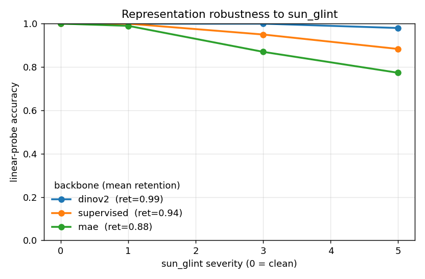

# AquaCorrupt

**Does the pretraining objective decide how well a vision backbone survives looking at a reef through the air-water interface?**

A small, honest robustness benchmark. We corrupt labeled coral imagery with physically-motivated air-water-interface effects (sun glint, refractive wave distortion, water-column attenuation), then measure how gracefully frozen features from different backbones degrade under a linear probe. No backbone is ever trained, so the whole thing runs cheap.

> **Status: MVP (minimum viable pilot).** This is the afternoon version: three backbones, one corruption (glint) at three severities, one dataset, a linear probe. Its only job is to tell you whether there is any signal worth chasing before you invest in the full study. If the robustness curves separate, build it out (see [Full study](#full-study)). If they do not, you have a clean negative result and you stop.

---

## The question and why it might matter

SSL (self-supervised learning) comes in two broad flavors: reconstructive methods that predict raw pixels (for example MAE, Masked Autoencoders), and joint-embedding / latent-predictive methods that predict in representation space (the JEPA, Joint-Embedding Predictive Architecture, family). SAR-JEPA showed that predicting in feature space is robust to speckle noise precisely because the model can throw away unpredictable pixel-level detail. Waves and sun glint are a different corruption, but the same argument might apply: a latent-predictive backbone may ignore the shimmering surface and keep the coral structure, while a reconstructive one wastes capacity modeling the water.

Nobody has tested this in the aquatic-distortion regime. That is the gap this fills.

**Hypothesis:** latent-predictive / joint-embedding features degrade more slowly than reconstructive features as air-water corruption severity rises. The supervised model is the control.

Either outcome is informative. A win is a positive finding plus a reusable benchmark. A null is a falsified-but-plausible assumption. That is the point: the experiment is cheap to run and informative whichever way it lands.

---

## The novel artifact: AquaCorrupt corruptions

`src/corruptions.py` implements three parameterized, seeded corruptions (severity 1..5), grounded in the fluid-lensing literature (Chirayath & Earle 2016; Chirayath & Instrella 2019):

- `sun_glint` : specular highlights off wave crests, added on top of the image
- `refractive_warp` : a spatially-varying "wave lens" that displaces the seafloor
- `water_attenuation` : wavelength-dependent absorption (red dies first) plus a blue-green scattering veil

Same seed + severity gives deterministic, paired clean/corrupted samples. Example at max severity (clean, glint, warp, attenuation):


---

## Quickstart

```bash
pip install -r requirements.txt

# 0. get data (Kaggle "Healthy and Bleached Corals"); --download needs ~/.kaggle/kaggle.json
python scripts/00_download_data.py --download

# 1. extract frozen features (GPU worth it here; CPU fine if MAX_PER_CLASS is small)
python scripts/01_extract_features.py --device cuda

# 2. linear probe + robustness metrics (CPU, seconds)  -> results/metrics.json
python scripts/02_run_probe.py

# 3. plot the curve (CPU, instant)                      -> results/robustness_curve.png
python scripts/03_plot_curves.py
```

Illustrative shape of the output (this figure is from **synthetic** features, just to show what a result looks like; it is not a real measurement):



All knobs live in `config.py` (backbones, corruption, severities, image cap, paths).

---

## Compute reality

- The only step that wants a GPU is feature extraction (step 1). Everything after is a logistic regression on cached vectors and runs on a laptop CPU in seconds.
- The MVP is deliberately small (`MAX_PER_CLASS = 1000`, ViT-B backbones), so even step 1 is CPU-feasible if you are patient.
- If you want the GPU without a local card, use `notebooks/colab_extract_features.ipynb`: it clones the repo, downloads the data, extracts features on a Colab GPU, and hands you back the cached embeddings (or runs the probe + plot in-notebook). See the repo discussion notes for why an agent cannot drive Colab directly.

---

## The MVP backbones

| name | objective | load |
| --- | --- | --- |
| `mae` | reconstructive SSL | timm `vit_base_patch16_224.mae` |
| `dinov2` | joint-embedding SSL (JEPA-adjacent) | torch.hub `facebookresearch/dinov2` |
| `supervised` | label-trained control | timm `vit_base_patch16_224.augreg_in21k_ft_in1k` |

**Honest substitution:** the cleanest test of the hypothesis uses *true* I-JEPA. Its released checkpoints are fiddly to load (often ViT-H/14, custom key layout), so the MVP uses DINOv2 as a one-line-loadable non-reconstructive stand-in. `src/backbones.load_ijepa()` sketches the faithful loader for the full study, but it is untested until you point it at a real checkpoint. Do not report I-JEPA numbers from the stub.

---

## Full study

Turn the MVP into something publishable (target: an ML-for-climate or computer-vision-for-ecology workshop) by widening each axis:

1. **Faithful I-JEPA** via `load_ijepa()` with a real checkpoint, matched at ViT-B where possible.
2. **All three corruptions** at all five severities (`FULL_SEVERITIES` in `src/corruptions.py`), plus a combined "all three at once" condition.
3. **An Earth-observation arm**: AnySat (JEPA-based) and Core-JEPA, on top-down drone/aerial benthic imagery rather than underwater macro photos, which is what those models expect.
4. **A harder dataset**: the NOAA PIFSC ESD Coral Bleaching Dataset (point annotations on photoquadrats), and a second geography to test generalization.
5. **External validity check**: rank the backbones on a small set of *real* through-water drone imagery and confirm the ordering matches the simulated ranking.

---

## Honesty / limitations

- The corruptions are plausible approximations, not a radiometric water-optics simulator. The headline risk is that simulated-distortion robustness does not transfer to real above-water imagery. Mitigate with the external validity check above, and frame any writeup as "robustness to simulated air-water corruption," not "solves coral monitoring."
- This does not attempt to beat operational systems (Allen Coral Atlas, NOAA Coral Reef Watch). It is a representation-robustness study, not a coral map.
- Two classes (healthy / bleached) in the MVP is a toy readout. The full study should use richer benthic labels.

---

## Data and model credits

- Dataset (MVP): Kaggle, "Healthy and Bleached Corals Image Classification" (vencerlanz09).
- Dataset (full): NOAA PIFSC Ecosystem Sciences Division Coral Bleaching Dataset.
- Backbones: MAE and I-JEPA (Meta AI / FAIR), DINOv2 (Meta AI), supervised ViT via `timm`.
- Corruption model inspired by NASA fluid-lensing work (Chirayath et al.).

## License

MIT. See [LICENSE](LICENSE).
