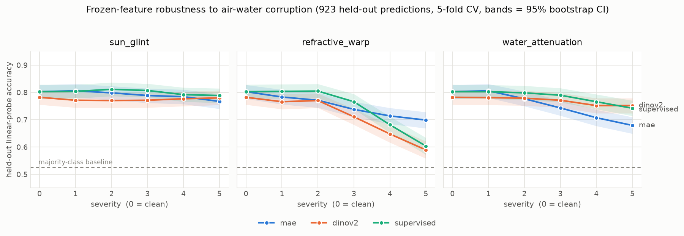
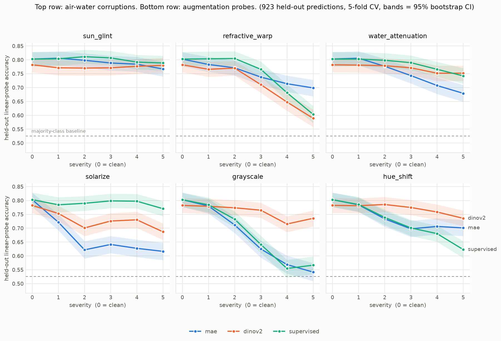

# AquaCorrupt

**Does the pretraining objective decide how well a vision backbone survives looking at a reef through the air-water interface?**

A small, honest robustness benchmark. We corrupt labeled coral imagery with physically-motivated air-water-interface effects (sun glint, refractive wave distortion, water-column attenuation), then measure how gracefully frozen features from different backbones degrade under a linear probe. No backbone is ever trained, so the whole thing runs cheap.

> **Status: pilot complete. The hypothesis is not supported, and we know why.** Three
> backbones, three air-water corruptions plus three augmentation probes, five severities
> each, 923 images, linear probe. The joint-embedding backbone is indistinguishable from
> the supervised control on every air-water corruption. The one significant effect is an
> **augmentation artifact**: a follow-up probe experiment shows backbone robustness ranking
> *inverts* depending on which photometric transform you apply, tracking the specific
> augmentation operations each model was pretrained with rather than its objective. See
> [Results](#results) before building anything on top of this.

---

## The question and why it might matter

SSL (self-supervised learning) comes in two broad flavors: reconstructive methods that predict raw pixels (for example MAE, Masked Autoencoders), and joint-embedding / latent-predictive methods that predict in representation space (the JEPA, Joint-Embedding Predictive Architecture, family). SAR-JEPA showed that predicting in feature space is robust to speckle noise precisely because the model can throw away unpredictable pixel-level detail. Waves and sun glint are a different corruption, but the same argument might apply: a latent-predictive backbone may ignore the shimmering surface and keep the coral structure, while a reconstructive one wastes capacity modeling the water.

Nobody has tested this in the aquatic-distortion regime. That is the gap this fills.

**Hypothesis:** latent-predictive / joint-embedding features degrade more slowly than reconstructive features as air-water corruption severity rises. The supervised model is the control.

Either outcome is informative. A win is a positive finding plus a reusable benchmark. A null is a falsified-but-plausible assumption. That is the point: the experiment is cheap to run and informative whichever way it lands.

---

## The novel artifact: AquaCorrupt corruptions

`src/corruptions.py` implements three parameterized, seeded corruptions (severity 1..5), grounded in the fluid-lensing literature (Chirayath & Earle 2016; Chirayath & Instrella 2019):

- `sun_glint` : specular highlights off wave crests, added on top of the image
- `refractive_warp` : a spatially-varying "wave lens" that displaces the seafloor
- `water_attenuation` : wavelength-dependent absorption (red dies first) plus a blue-green scattering veil

Same seed + severity gives deterministic, paired clean/corrupted samples. Example at max severity (clean, glint, warp, attenuation):


---

## Quickstart

```bash
pip install -r requirements.txt

# optional: confirm the pipeline runs in your env (no downloads, ~10s, numbers meaningless)
python smoke_test.py

# optional: dataset-layout regression tests (fast, no downloads, no GPU)
python tests/test_data_layout.py

# 0. get data (Kaggle "Healthy and Bleached Corals").
#    The dataset is public, so --download works without credentials; the kaggle client
#    prints an auth banner regardless. Ignore it and check the reported layout.
python scripts/00_download_data.py --download

# 1. extract frozen features (--device cuda | mps | cpu)
python scripts/01_extract_features.py --device cuda

# 2. linear probe + robustness metrics (CPU, seconds)  -> results/metrics.json
python scripts/02_run_probe.py

# 3. plot the curve (CPU, instant)                      -> results/robustness_curve.png
python scripts/03_plot_curves.py
```

**The headline MVP (steps 1-3) is underpowered on purpose-built-small settings.** One
corruption at three severities, scored on a single 185-image split, cannot resolve the
differences it is asked about. Steps 4-6 are the version whose null result means
something — all three corruptions at all five severities, k-fold CV so every image is a
held-out prediction, and bootstrap confidence intervals on every comparison:

```bash
# 4. embed every image under clean + 3 corruptions x 5 severities (the long step)
python scripts/04_extract_full_grid.py --device cuda

# 5. k-fold CV probe + paired bootstrap CIs           -> results/grid_metrics.json
python scripts/05_analyze_grid.py

# 6. small-multiples figure with CI bands             -> results/robustness_grid.png
python scripts/06_plot_grid.py
```

Read `mean_retention` and `mean_corrupted_acc` together. Retention divides each backbone
by *its own* clean accuracy, so a weak-but-flat backbone can outrank a strong one that
starts higher and gives up more.

All knobs live in `config.py` (backbones, corruption, severities, image cap, paths).

---

## Results

Kaggle corals (923 images: 485 bleached / 438 healthy), frozen ViT-B backbones, linear
probe, 5-fold CV so all 923 images are held-out predictions, majority-class baseline
0.525. Uncertainty is a 10,000-sample paired bootstrap; the nine pairwise tests
(3 corruptions x 3 backbone pairs) carry a Holm-Bonferroni correction.



Mean retention (accuracy at severity s, averaged over s=1..5, divided by that backbone's
own clean accuracy). Clean accuracy: mae 0.803, dinov2 0.782, supervised 0.803.

| backbone | objective | sun_glint | refractive_warp | water_attenuation |
| --- | --- | --- | --- | --- |
| `mae` | reconstructive | 0.983 | **0.923** | 0.925 |
| `dinov2` | joint-embedding | 0.989 | 0.891 | **0.981** |
| `supervised` | control | **0.997** | 0.912 | 0.971 |

**The hypothesis is not supported.** Three things, in order of how much they matter:

1. **DINOv2 never separates from the supervised control** — on any corruption, at any
   severity (Holm-adjusted p = 1.00, 0.96, 1.00). The study is built to ask whether a
   non-reconstructive objective buys robustness that label supervision does not. It
   does not, anywhere in this grid.
2. **The only surviving effect is MAE being *worse*** on `water_attenuation`, vs both
   dinov2 (-0.056, p_holm 0.002) and supervised (-0.047, p_holm 0.008).
3. **The ordering flips between corruptions.** On `refractive_warp` MAE is nominally the
   *most* robust of the three — the reverse ranking. That flip does not survive
   correction (raw p 0.034 -> p_holm 0.239; it is exactly the kind of result that
   multiple-comparison correction exists to kill), but it means there is no consistent
   "reconstructive is more fragile" ordering to report even directionally.

**The one real effect is probably augmentation, not objective.** `water_attenuation` is a
purely photometric corruption: per-channel gain, an additive veil, a contrast wash. MAE
pretrains with random-resized-crop and horizontal flip essentially alone, while DINOv2
(color jitter, blur, solarization) and the AugReg supervised ViT (RandAugment, which
includes color/brightness/contrast/solarize ops) both see heavy photometric augmentation.
The backbones that saw color augmentation resist a color corruption; the one that did not,
does not. That is a cleaner explanation of the grid than the pretraining objective, and it
predicts what we observe on `refractive_warp` — a *geometric* corruption none of the three
augment for, where nothing separates.

Raw numbers, per-severity CIs, and all nine tests: `results/grid_metrics.json`.

### Testing the confound directly

To separate the two explanations we added three **augmentation probes** (`src/aug_probes.py`
— diagnostics, deliberately *not* part of the physical corruption suite). Each sits inside
some models' pretraining augmentation distribution and outside others'. Predictions were
written down before running: the augmentation account expects MAE's deficit to be *larger*
here than the 0.056 it showed on `water_attenuation`.



Mean retention, all six transforms, Holm-corrected across all 18 pairwise tests:

| transform | mae | dinov2 | supervised | who trains with it |
| --- | --- | --- | --- | --- |
| `sun_glint` | 0.983 | 0.989 | 0.997 | — (no separation) |
| `refractive_warp` | 0.923 | 0.891 | 0.912 | — (no separation) |
| `water_attenuation` | 0.925 | **0.981** | 0.971 | photometric: dinov2 + supervised |
| `solarize` | 0.804 | 0.920 | **0.982** | RandAugment core op; DINOv2 p=0.2, one crop |
| `grayscale` | 0.804 | **0.963** | 0.817 | DINOv2 random-grayscale; not a RandAugment op |
| `hue_shift` | 0.903 | **0.981** | 0.879 | DINOv2 color jitter (hue); RandAugment has saturation, not hue |

**This kills the objective hypothesis rather than rescuing it.** The ranking is not stable
across photometric corruptions — it *inverts*, and it inverts in the direction that
augmentation exposure predicts, operation by operation:

- **MAE**, with no photometric augmentation at all, is worst or tied-worst on all three
  probes (deficits of 0.115 / 0.159 / 0.078 vs dinov2, all p_holm < 0.001 — every one
  larger than its 0.056 deficit on `water_attenuation`, as predicted).
- **DINOv2** dominates `grayscale` (+0.146) and `hue_shift` (+0.101) over the supervised
  control — both squarely in its augmentation set — yet **loses** `solarize` to it
  (-0.062, p_holm 0.002), which is a core RandAugment operation.
- **Supervised** is statistically indistinguishable from MAE on `grayscale` (p_holm 1.00)
  and `hue_shift` (p_holm 1.00) — the two ops RandAugment does not cover.

A pretraining objective that conferred general robustness would produce a stable ordering.
Instead the ordering is a function of which specific augmentation each model happened to
see. The one "finding" from the physical grid is an augmentation artifact, and the
supervised control beats the SSL model on a third of the probes, so there is no
SSL-versus-supervised story either.

One prediction we got wrong, recorded for honesty: we expected `dinov2 - supervised` to
stay near zero on all three probes, on the reasoning that both pretrain with "heavy
photometric augmentation." They separate strongly and in both directions. Lumping
augmentation recipes together was too coarse — the effect resolves at the level of
individual operations, which is a stronger version of the same account.

**Caveat:** the mapping from model to augmentation operations is read off the published
recipes (MAE; DINOv2; AugReg), not verified against training code here. That mapping is
the load-bearing assumption in this interpretation and is worth confirming before it is
relied on.

Raw numbers for all six: `results/grid_metrics_full.json`.

---

## Compute reality

- The only step that wants a GPU is feature extraction (step 1). Everything after is a logistic regression on cached vectors and runs on a laptop CPU in seconds.
- The MVP is deliberately small (`MAX_PER_CLASS = 1000`, ViT-B backbones), so even step 1 is CPU-feasible if you are patient.
- If you want the GPU without a local card, use `notebooks/colab_extract_features.ipynb`: it clones the repo, downloads the data, extracts features on a Colab GPU, and hands you back the cached embeddings (or runs the probe + plot in-notebook).
- On a SLURM cluster (for example Stanford Sherlock), stage the dataset on a login node, then `sbatch slurm_extract.sbatch` runs extraction on a GPU node plus the probe and plot.

---

## The MVP backbones

| name | objective | load |
| --- | --- | --- |
| `mae` | reconstructive SSL | timm `vit_base_patch16_224.mae` |
| `dinov2` | joint-embedding SSL (JEPA-adjacent) | torch.hub `facebookresearch/dinov2` |
| `supervised` | label-trained control | timm `vit_base_patch16_224.augreg_in21k_ft_in1k` |

**Honest substitution:** the cleanest test of the hypothesis uses *true* I-JEPA. Its released checkpoints are fiddly to load (often ViT-H/14, custom key layout), so the MVP uses DINOv2 as a one-line-loadable non-reconstructive stand-in. `src/backbones.load_ijepa()` sketches the faithful loader for the full study, but it is untested until you point it at a real checkpoint. Do not report I-JEPA numbers from the stub.

---

## Full study

Turn the MVP into something publishable (target: an ML-for-climate or computer-vision-for-ecology workshop) by widening each axis:

1. **Faithful I-JEPA** via `load_ijepa()` with a real checkpoint, matched at ViT-B where possible.
2. **All three corruptions** at all five severities (`FULL_SEVERITIES` in `src/corruptions.py`), plus a combined "all three at once" condition.
3. **An Earth-observation arm**: AnySat (JEPA-based) and Core-JEPA, on top-down drone/aerial benthic imagery rather than underwater macro photos, which is what those models expect.
4. **A harder dataset**: the NOAA PIFSC ESD Coral Bleaching Dataset (point annotations on photoquadrats), and a second geography to test generalization.
5. **External validity check**: rank the backbones on a small set of *real* through-water drone imagery and confirm the ordering matches the simulated ranking.

---

## Honesty / limitations

- The corruptions are plausible approximations, not a radiometric water-optics simulator. The headline risk is that simulated-distortion robustness does not transfer to real above-water imagery. Mitigate with the external validity check above, and frame any writeup as "robustness to simulated air-water corruption," not "solves coral monitoring."
- This does not attempt to beat operational systems (Allen Coral Atlas, NOAA Coral Reef Watch). It is a representation-robustness study, not a coral map.
- Two classes (healthy / bleached) in the MVP is a toy readout. The full study should use richer benthic labels.

---

## Data and model credits

- Dataset (MVP): Kaggle, "Healthy and Bleached Corals Image Classification" (vencerlanz09).
- Dataset (full): NOAA PIFSC Ecosystem Sciences Division Coral Bleaching Dataset.
- Backbones: MAE and I-JEPA (Meta AI / FAIR), DINOv2 (Meta AI), supervised ViT via `timm`.
- Corruption model inspired by NASA fluid-lensing work (Chirayath et al.).

## License

MIT. See [LICENSE](LICENSE).
